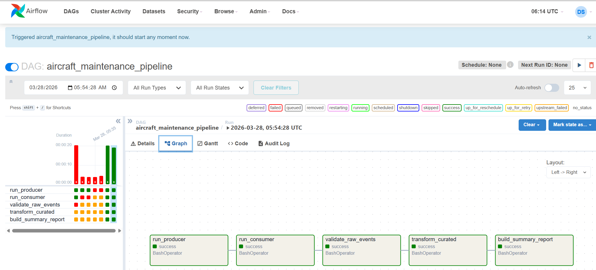

````markdown
# Airflow Kafka Aircraft Maintenance Pipeline

End-to-end data pipeline using:

- Apache Airflow
- Apache Kafka
- Docker Compose
- Python

## Pipeline

1. Producer → sends aircraft events to Kafka
2. Consumer → reads events and stores raw data
3. Validator → validates raw events
4. Transformer → builds curated dataset
5. Summary → generates report

## Run

```bash
docker compose up -d
````

Open Airflow UI:
[http://localhost:8080](http://localhost:8080)

## Notes

* Kafka runs with internal/external listeners
* Data stored in `/opt/airflow/data`

## Pipeline Results

### Airflow Execution


### Sample Outputs

**Raw Events (Kafka → JSONL)**
- docs/samples/raw_events_sample.jsonl

**Curated Dataset**
- docs/samples/curated_events_sample.csv

**Daily Summary**
- docs/samples/summary_report_sample.csv

**Validation Report**
- docs/samples/validation_report.txt

The pipeline processes aircraft maintenance events through:

- Raw ingestion from Kafka
- Validation and cleansing
- Transformation into curated datasets
- Aggregation into daily summaries
````
