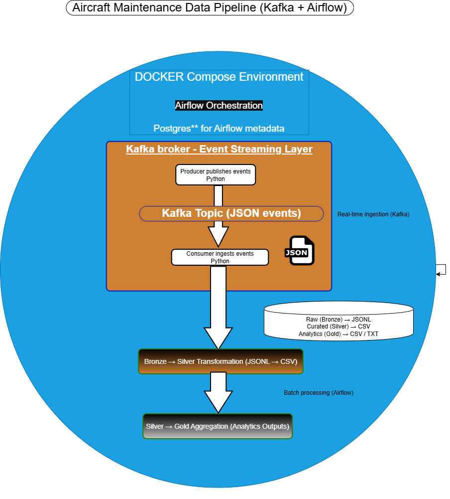

# Aircraft Maintenance Data Pipeline (Kafka + Airflow)

Streaming + batch data pipeline that ingests aircraft maintenance events 
via Kafka and processes them into validated, curated, and aggregated datasets using Airflow.

---

## Tech Stack

- Apache Airflow – orchestration
- Apache Kafka – streaming ingestion
- Docker Compose – containerized environment
- Python – data processing scripts
- Postgres – Airflow metadata database

## Pipeline

1. **Producer** – publishes aircraft maintenance events to Kafka
2. **Kafka Broker** – streams event data via topic `aircraft_maintenance_events`
3. **Consumer** – ingests events and writes raw JSONL files (Bronze layer)
4. **Validation** – checks data quality and schema compliance
5. **Transformation** – converts raw data into curated CSV datasets (Silver layer)
6. **Aggregation** – generates summary reports (Gold layer)

## Run

Start the full pipeline:

```bash
docker compose up -d
```

Open Airflow UI:
[Open Airflow UI](http://localhost:8080)

## Architecture

This architecture integrates real-time event streaming with scheduled batch
processing, enabling scalable data ingestion and transformation.

<p align="center">
  
</p>
The pipeline combines real-time ingestion (Kafka) with batch orchestration (Airflow) 
using a medallion architecture (Bronze → Silver → Gold).

## Notes

* Kafka runs with internal/external listeners
* Data stored in `/opt/airflow/data`

## Pipeline Results

### Airflow Execution


### Sample Outputs

### Raw Events (Kafka → JSONL)
- [Raw Events Sample](docs/samples/raw_events_sample.jsonl)

### Curated Dataset
- [Curated Dataset Sample](docs/samples/curated_events_sample.csv)

### Daily Summary
- [Daily Summary Sample](docs/samples/summary_report_sample.csv)

### Validation Report
- [Validation Report Sample](docs/samples/validation_report.txt)

The pipeline processes aircraft maintenance events through:

- Raw ingestion from Kafka
- Validation and cleansing
- Transformation into curated datasets
- Aggregation into daily summaries


## Highlights

- Demonstrates real-time + batch hybrid data pipeline design
- Implements medallion architecture (Bronze → Silver → Gold)
- Uses Docker Compose for reproducible local deployment
- Integrates Kafka streaming with Airflow orchestration

## Challenges & Lessons Learned

- Resolved Kafka `NoBrokersAvailable` via advertised listeners configuration
- Fixed Docker container networking between Airflow and Kafka
- Addressed file path inconsistencies using absolute container paths
- Resolved permission issues with mounted volumes
