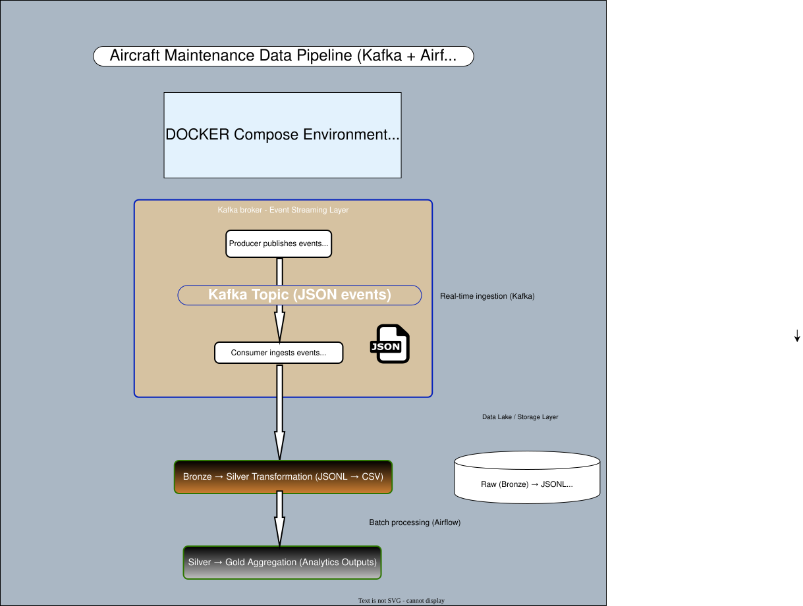
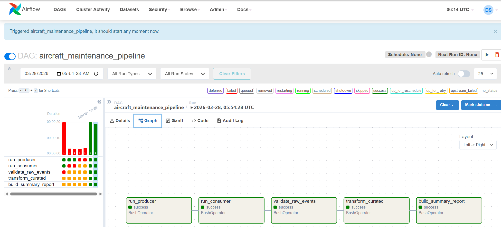
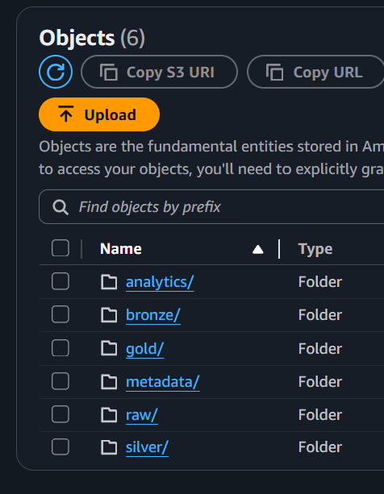
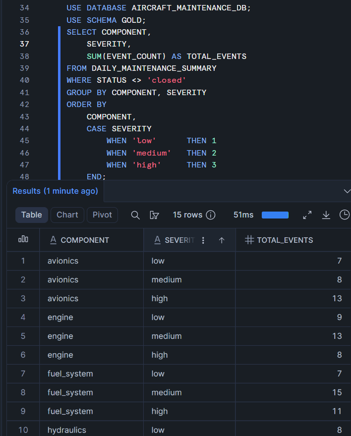
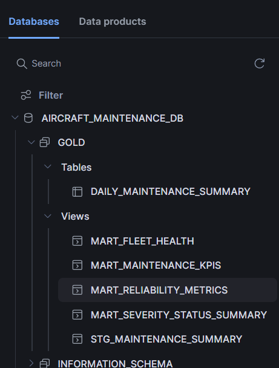
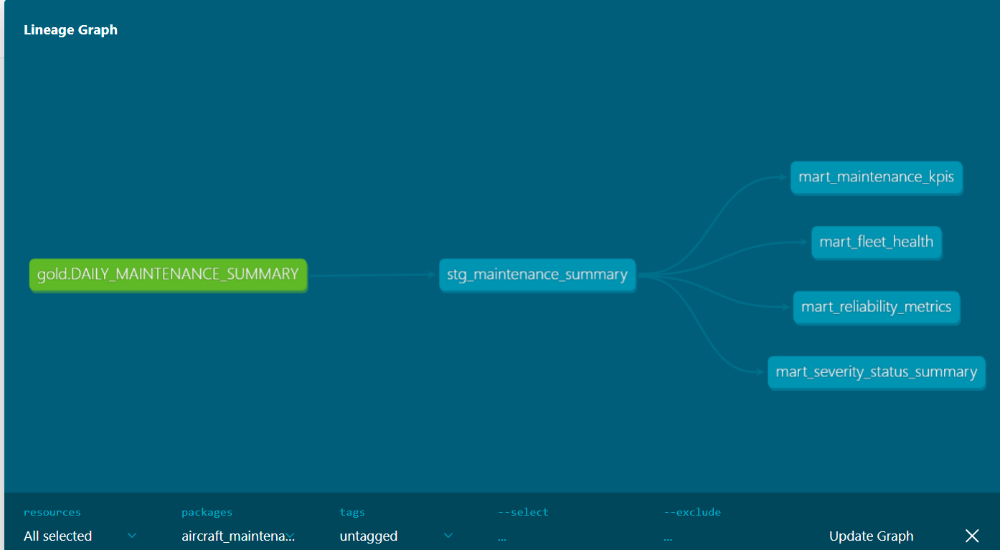
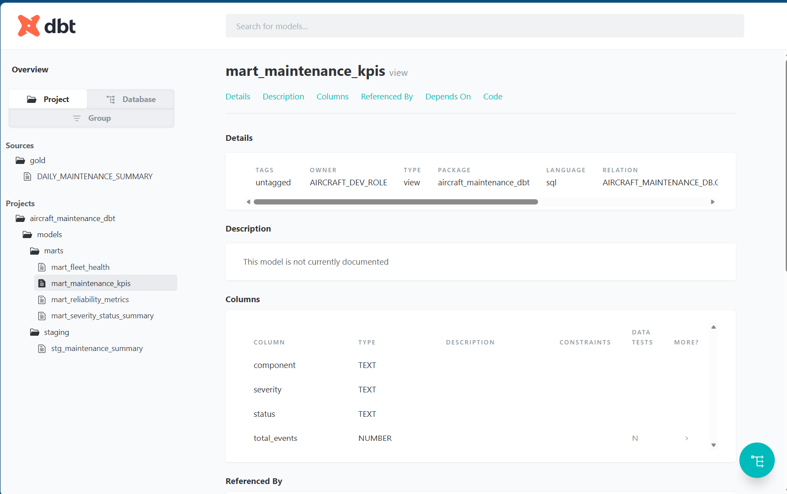
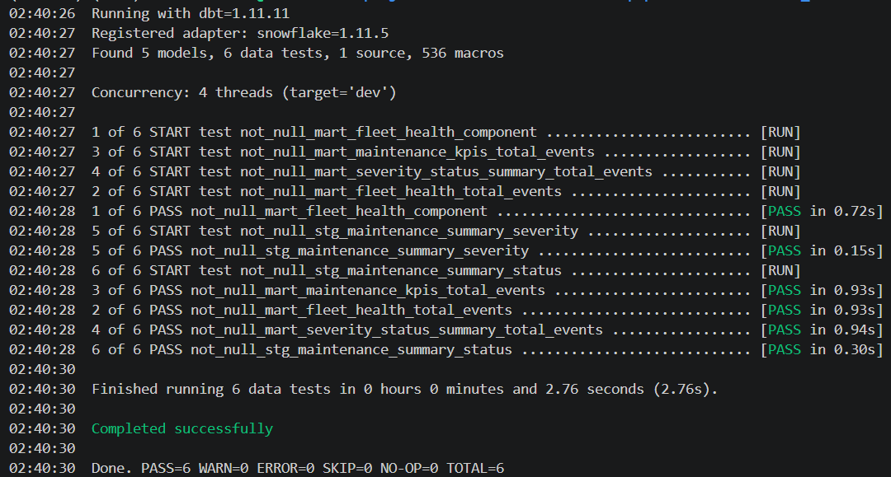
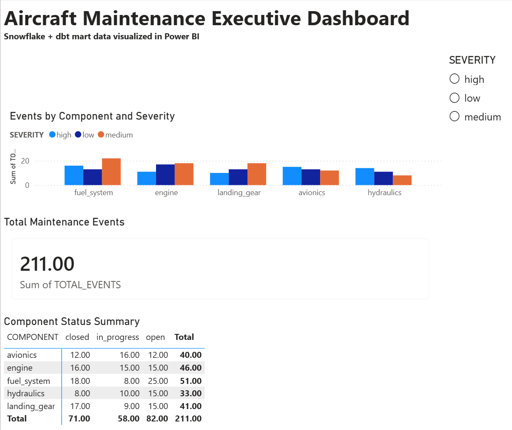

# Aircraft Maintenance Data Pipeline (Kafka + Airflow)

Streaming + batch data pipeline that ingests aircraft maintenance events via Kafka 
and processes them into validated, curated, and aggregated datasets using Airflow.

The system is designed to simulate real-world data engineering challenges including 
Kafka offset management, idempotent ingestion, and pipeline observability.

This is a personal, independently developed data engineering project. External contributions are not enabled to maintain a consistent architectural vision and implementation approach.
---

## Tech Stack

- Apache Airflow – orchestration and scheduling
- Apache Kafka – real-time event streaming
- S3 stores pipeline outputs across `raw/`, `bronze/`, `silver/`, and `gold/` layers, with `metadata/` used for manifest tracking and `analytics/` reserved for reporting-ready outputs.
- Python – data processing and transformation
- Docker Compose – containerized local environment
- PostgreSQL – Airflow metadata database
- Snowflake – warehouse layer for analytics-ready data
- dbt – semantic modeling, testing, and lineage

## Pipeline

The pipeline follows a medallion architecture with hybrid streaming and batch processing:

1. **Event Producer**
   - Publishes aircraft maintenance events to Kafka

2. **Streaming Ingestion (Kafka)**
   - Topic: `aircraft_maintenance_events`
   - Consumer group-based ingestion with offset management
   - Enables decoupled, real-time data flow

3. **Raw Ingestion (Raw Layer)**
   - Consumer writes JSONL files to S3
   - Manifest tracking ensures idempotent ingestion and safe reprocessing

4. **Validation Layer (Bronze Layer)**
   - Enforces schema and data quality rules
   - Generates validation reports

5. **Transformation Layer (Silver)**
   - Converts raw events into structured datasets

6. **Aggregation Layer (Gold)**
   - Produces daily summaries for analytics and downstream warehouse loading

7. **Snowflake Analytics Layer**
   - Loads Gold-layer summary data into Snowflake
   - Supports SQL-based analytics and future BI reporting

8. **dbt Semantic Layer**
   - Consumes curated Snowflake Gold data
   - Creates business-facing reporting marts
   - Provides automated lineage documentation
   - Implements data quality testing

## Run

Start the full pipeline:

```bash
docker compose up -d
```

Open Airflow UI:
[Open Airflow UI](http://localhost:8080)

## Architecture

This architecture integrates real-time event streaming with scheduled batch
processing, enabling scalable data ingestion and transformation.

The design emphasizes scalability, idempotency, and fault tolerance across streaming and batch components.

Key design considerations include data consistency, replayability, and fault recovery across pipeline stages.

<p align="center">
  
</p>
The pipeline combines real-time ingestion (Kafka) with batch orchestration (Airflow) 
using a medallion architecture (Raw → Bronze → Silver → Gold).

Gold-layer summary outputs are loaded into Snowflake for warehouse-based analytics and downstream reporting workflows.

## Notes

- Kafka configured with internal/external listeners for container networking
- Data persisted via mounted volumes (`/opt/airflow/data`)

## Pipeline Results

### Airflow Execution


### S3 Medallion Storage

Pipeline outputs are organized in Amazon S3 using a medallion-style layout. Raw Kafka events are persisted to `raw/`, validated records flow through `bronze/`, curated datasets are written to `silver/`, and aggregated reporting outputs are written to `gold/`.

The `metadata/` folder supports manifest-based tracking for idempotent ingestion, while `analytics/` is reserved for reporting-ready outputs.



### Snowflake Analytics Layer

Gold-layer summary data is loaded into Snowflake for warehouse-based analytics queries.



### Sample Outputs

### Raw Events (Kafka → JSONL)
- [Raw Events Sample](docs/samples/raw_events_sample.jsonl)

### Curated Dataset
- [Curated Dataset Sample](docs/samples/curated_events_sample.csv)

### Daily Summary
- [Daily Summary Sample](docs/samples/summary_report_sample.csv)

### Validation Report
- [Validation Report Sample](docs/samples/validation_report.txt)

### End-to-End Flow Summary
- Raw ingestion from Kafka
- Validation and cleansing
- Transformation into structured datasets
- Aggregation into Gold-layer daily summaries
- Snowflake warehouse analytics integration

## dbt Semantic Layer

dbt provides a semantic and reporting layer on top of curated Snowflake Gold data. The project implements source definitions, staging models, reporting marts, automated testing, and lineage documentation.

### Model Structure

```text
Source
  DAILY_MAINTENANCE_SUMMARY
           ↓
stg_maintenance_summary
           ↓
├── mart_fleet_health
├── mart_maintenance_kpis
├── mart_reliability_metrics
└── mart_severity_status_summary
```

### Snowflake Gold Layer

The Snowflake Gold schema contains curated reporting objects generated by dbt, including staging models and business-facing marts.



### dbt Lineage

dbt automatically generates lineage documentation, showing dependencies from source data through staging models and downstream reporting marts.



### dbt Model Documentation



### dbt Testing

Automated data quality validation is performed using dbt tests.



### Current state:
Gold summary data has been loaded into Snowflake and modeled with dbt into staging and mart views.

### Planned enhancement:
Automate the Snowflake load and dbt execution as downstream Airflow tasks so each pipeline batch refreshes the warehouse and reporting marts end-to-end.


## Power BI Dashboard

This project includes a Power BI executive dashboard connected to the Snowflake/dbt gold mart.

The dashboard visualizes maintenance KPI data from:

`AIRCRAFT_MAINTENANCE_DB.GOLD.MART_MAINTENANCE_KPIS`

Report file:

```text
powerbi/aircraft_maintenance_executive_dashboard.pbix
```

Dashboard screenshot:



The report includes:

* Total maintenance events card
* Events by component and severity bar chart
* Component status summary matrix
* Severity slicer

This completes the visualization layer of the pipeline:

```text
Kafka → Airflow/Python → S3 Medallion → Snowflake → dbt → Power BI
```


---

## Highlights

- Demonstrates real-time + batch hybrid data pipeline design
- Implements medallion architecture (Bronze → Silver → Gold)
- Uses Docker Compose for reproducible local deployment
- Integrates Kafka streaming with Airflow orchestration
- Solves real-world Kafka ingestion and offset management issues
- Designed with production-style patterns: idempotency, retry logic, and observability
- Implements idempotent ingestion using manifest tracking
- Integrates Snowflake warehouse analytics layer
- Supports downstream BI/reporting workflows
- Implements dbt semantic modeling layer
- Includes automated dbt testing and lineage documentation

## Key Challenges & Solutions

### Kafka Consumer Only Reading One Message
**Problem:**  
Kafka consumer was only processing a single message instead of a continuous stream.

**Root Cause:**  
Producer send logic was incorrectly scoped, causing only one message to be published per execution.

**Solution:**  
Refactored producer to send messages in a loop and validated using Kafka topic monitoring.

---

### Offset Management Causing Partial Reads
**Problem:**  
Consumers were inconsistently reading messages, leading to missing or duplicate data.

**Root Cause:**  
Improper offset handling and lack of clear reset strategy.

**Solution:**  
Implemented controlled offset reset strategy and validated consumer group behavior to ensure full data consumption.

---

### Transition from Local Filesystem to S3 Data Lake
**Problem:**  
Initial pipeline relied on local storage, limiting scalability and realism.

**Solution:**  
Migrated ingestion and transformation layers to Amazon S3:
- Introduced raw, bronze, and silver layers
- Enabled persistent, scalable storage
- Improved pipeline realism to match production architectures

---

### Idempotent Bronze Layer Ingestion
**Problem:**  
Risk of duplicate processing when re-running pipelines.

**Solution:**  
Implemented manifest-based tracking to ensure only new files are processed, making ingestion idempotent.

---

### Observability & Debugging
**Problem:**  
Limited visibility into pipeline failures and data issues.

**Solution:**  
Added:
- Custom logging
- Airflow retry logic
- Improved traceability across pipeline stages

## Future Enhancements
- Databricks lakehouse integration
- Azure AI/ML notebook-based analytics workflows
- Azure AI Search integration
- GraphQL data access layer


