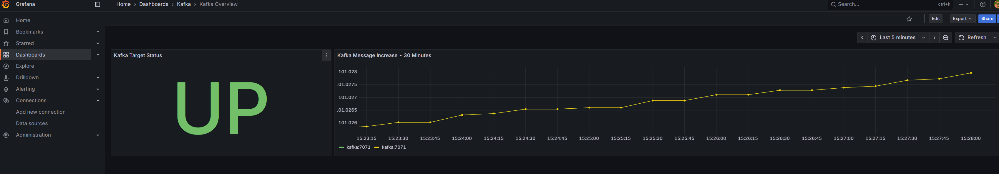
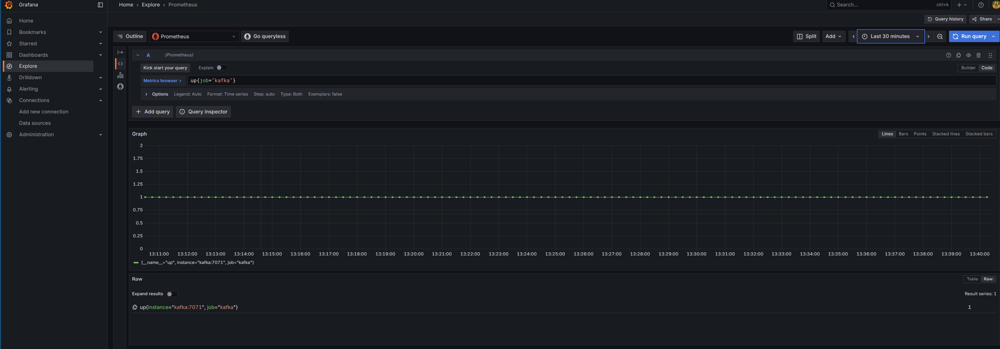
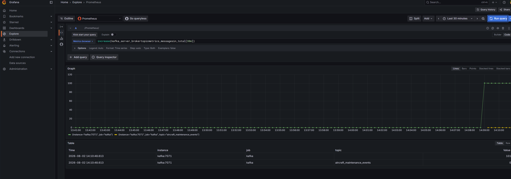
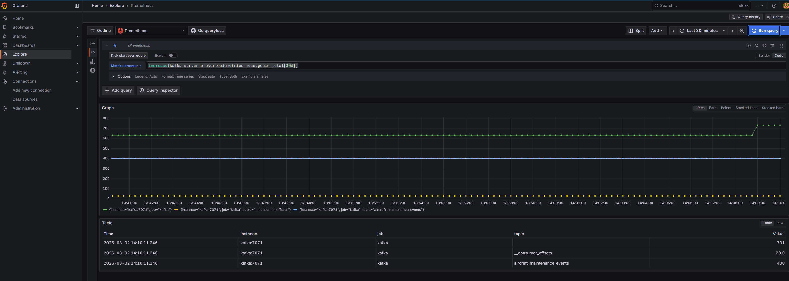

# Kafka and Pipeline Observability

## Purpose

This folder contains the monitoring configuration for the aircraft maintenance pipeline.

The observability stack monitors Kafka broker health and message activity. Kafka JVM metrics are exposed through the Prometheus JMX Exporter, scraped by Prometheus, and visualized in Grafana.

## Architecture

```text
Kafka JVM
  └── JMX Exporter Java Agent
        └── Prometheus
              └── Grafana
```

## Ports

| Component     | Port  | Notes                                     |
| ------------- | ----: | ----------------------------------------- |
| Kafka broker  | 9092  | Host access                               |
| Kafka broker  | 29092 | Internal Docker network access            |
| JMX Exporter  | 7071  | Internal Kafka container metrics endpoint |
| Prometheus UI | 9090  | Host browser access                       |
| Grafana UI    | 3000  | Host browser access                       |

## Configuration

Prometheus configuration:

```text
monitoring/prometheus.yml
```

Grafana Prometheus data source provisioning:

```text
monitoring/grafana/provisioning/datasources/prometheus.yml
```

Grafana dashboard provider configuration:

```text
monitoring/grafana/provisioning/dashboards/dashboards.yml
```

Provisioned Kafka dashboard:

```text
monitoring/grafana/dashboards/kafka-overview.json
```

## Metrics

Kafka broker metrics are exposed inside the Docker network at:

```text
http://kafka:7071/metrics
```

Prometheus scrapes this endpoint using the `kafka` job.

Useful PromQL queries:

```promql
up{job="kafka"}
```

```promql
kafka_server_brokertopicmetrics_messagesin_total
```

```promql
increase(kafka_server_brokertopicmetrics_messagesin_total[30m])
```

```promql
increase(kafka_server_brokertopicmetrics_messagesin_total[30d])
```

## Validation

Check running services:

```bash
docker compose ps
```

Open Prometheus targets:

```text
http://localhost:9090/targets
```

Expected targets:

```text
prometheus  UP
kafka       UP
```

Open Grafana:

```text
http://localhost:3000
```

The provisioned dashboard is available under:

```text
Dashboards → Kafka → Kafka Overview
```

Check Kafka metrics directly:

```bash
docker compose exec kafka \
  curl -s http://localhost:7071/metrics | head -n 20
```

Check Kafka broker metrics:

```bash
docker compose exec kafka sh -c \
  "curl -s http://localhost:7071/metrics | grep '^kafka_server_' | head -n 20"
```

Generate a fresh batch of Kafka events:

```bash
docker compose exec airflow-scheduler \
  python /opt/airflow/scripts/producer.py
```

Expected producer result:

```text
Produced 100 confirmed events
```

## Grafana Dashboard

The provisioned `Kafka Overview` dashboard contains:

- **Kafka Target Status** — displays `UP` when Prometheus can scrape Kafka.
- **Kafka Message Increase - 30 Minutes** — displays recent Kafka message activity.



## Prometheus Evidence

### Prometheus Targets

This confirms that Prometheus is successfully scraping both itself and Kafka.


### Kafka Broker Metric Query

This confirms that Kafka broker metrics are available in Prometheus.


### Kafka Recent Message Activity

This confirms that Prometheus can query Kafka message activity from the JMX Exporter target.


## Grafana Evidence

### Kafka Target Health



### Kafka Message Increase — 30 Minutes



### Kafka Message Increase — 30 Days



## Alerts

Alerting has not yet been implemented.

Planned first alert:

```text
Kafka target is down in Prometheus
```

Candidate PromQL expression:

```promql
up{job="kafka"} == 0
```

## Troubleshooting

### Docker image pull failed with CloudFront EOF

Symptom:

```text
failed to copy: httpReadSeeker: failed open: failed to do request ... CloudFront ... EOF
```

Prometheus uses the Quay.io image:

```yaml
image: quay.io/prometheus/prometheus:v3.12.0
```

### Docker Desktop WSL connection failed

Symptom:

```text
Cannot connect to the Docker daemon at unix:///var/run/docker.sock
```

Resolution:

```text
Docker Desktop → Settings → Resources → WSL Integration
```

Re-enable Ubuntu integration and restart Docker Desktop.

### Grafana dashboard shows no data

Confirm that both dashboard panels reference the provisioned Prometheus data source and that Kafka has received messages during the selected time range.

Generate fresh activity:

```bash
docker compose exec airflow-scheduler \
  python /opt/airflow/scripts/producer.py
```

Wait for the next Prometheus scrape, then refresh the dashboard.

## Implementation Status

Completed:

- Kafka migrated to KRaft mode.
- Kafka JMX Exporter configuration added.
- Custom Kafka image created with the JMX Exporter Java agent.
- Kafka exposes JMX metrics on port `7071`.
- Prometheus scrapes Kafka metrics.
- Prometheus targets show `prometheus` and `kafka` as `UP`.
- Grafana is provisioned with Prometheus as the default data source.
- Grafana dashboard provisioning is configured.
- Kafka health and message-activity panels are operational.
- Prometheus and Grafana screenshots were captured for portfolio evidence.

Remaining:

- Add a Prometheus alert rule.
- Add Grafana alerting or Alertmanager integration.
- Add alert validation screenshots.
