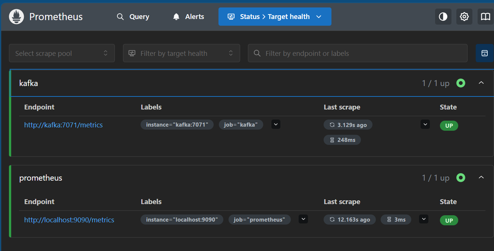
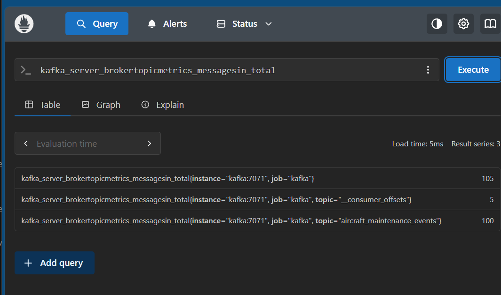
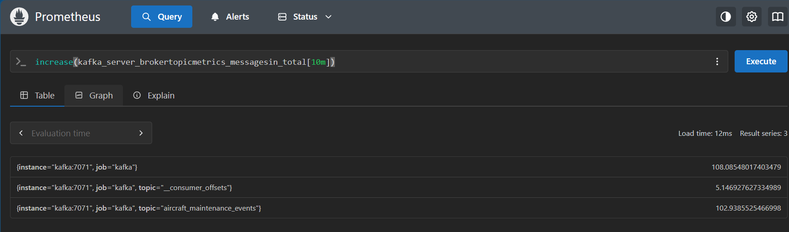
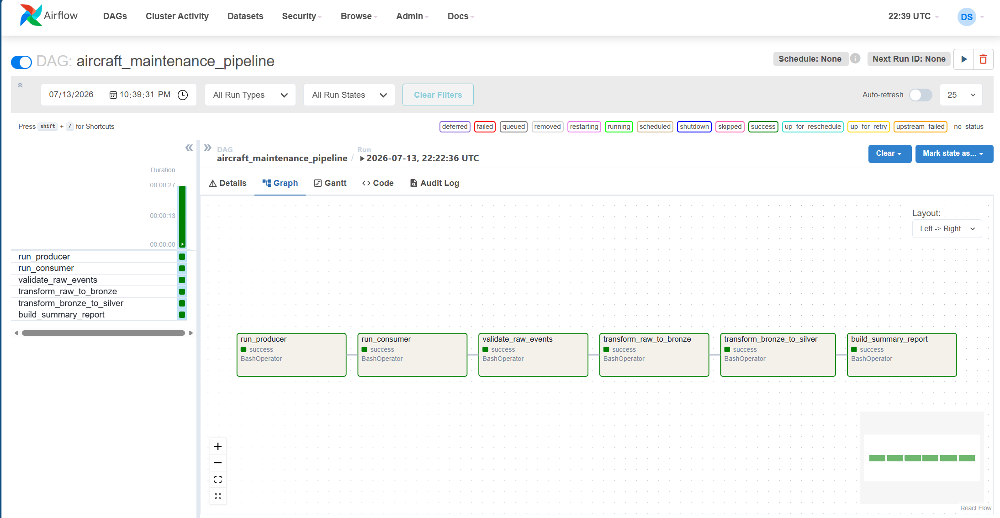

````markdown
# Kafka and Pipeline Observability

## Purpose

This folder contains the monitoring configuration for the aircraft maintenance pipeline.

The current observability stack monitors Kafka broker health and activity using Prometheus. Kafka metrics are exposed from the Kafka JVM through the Prometheus JMX Exporter Java agent.

## Architecture

```text
Kafka JVM
  └── JMX Exporter Java Agent
        └── Prometheus
              └── Grafana / Alerts planned
````

### Ports

| Component     |  Port | Notes                                     |
| ------------- | ----: | ----------------------------------------- |
| Kafka broker  |  9092 | Host access                               |
| Kafka broker  | 29092 | Internal Docker network access            |
| JMX Exporter  |  7071 | Internal Kafka container metrics endpoint |
| Prometheus UI |  9090 | Host browser access                       |

## Metrics

Kafka broker metrics are exposed at:

```text
http://kafka:7071/metrics
```

Prometheus scrapes this target using the `kafka` job.

Useful Prometheus queries:

```promql
up{job="kafka"}
```

```promql
kafka_server_brokertopicmetrics_messagesin_total
```

```promql
increase(kafka_server_brokertopicmetrics_messagesin_total[10m])
```

## Validation Commands

Check running services:

```bash
docker compose ps
```

Check Prometheus targets in the browser:

```text
http://localhost:9090/targets
```

Expected targets:

```text
prometheus  UP
kafka       UP
```

Check Kafka metrics directly from the Kafka container:

```bash
docker compose exec kafka \
  curl -s http://localhost:7071/metrics | head -n 20
```

Check Kafka broker metrics directly:

```bash
docker compose exec kafka sh -c \
  "curl -s http://localhost:7071/metrics | grep '^kafka_server_' | head -n 20"
```

## Screenshots

Prometheus validation screenshots are stored under:

```text
docs/images/prometheus/
```

These screenshots show Prometheus targets and Kafka metric query results.

## Screenshots

### Prometheus Targets

This confirms that Prometheus is running and successfully scraping both itself and Kafka.



### Kafka Broker Metric Query

This confirms that Kafka broker metrics are available in Prometheus.



### Kafka Recent Message Activity

This confirms that Prometheus can query Kafka message activity from the JMX Exporter target using a 10-minute increase window.



### Airflow DAG Success

This confirms that the aircraft maintenance pipeline DAG completed successfully.



## Alerts

Alerting has not been implemented yet.

Planned first alert:

```text
Kafka target is down in Prometheus
```

Candidate PromQL expression:

```promql
up{job="kafka"} == 0
```

## Troubleshooting Runbook

### Docker Hub image pull failed with CloudFront EOF

Symptom:

```text
failed to copy: httpReadSeeker: failed open: failed to do request ... CloudFront ... EOF
```

Resolution:

Prometheus was switched from Docker Hub to Quay.io:

```yaml
image: quay.io/prometheus/prometheus:v3.12.0
```

### Docker Desktop WSL connection failed

Symptom:

```text
Cannot connect to the Docker daemon at unix:///var/run/docker.sock
```

Resolution:

Docker Desktop WSL integration was re-enabled for Ubuntu:

```text
Docker Desktop → Settings → Resources → WSL Integration
```

Then Docker Desktop was restarted.

### Kafka exited with ZooKeeper NodeExists error

Symptom:

```text
org.apache.zookeeper.KeeperException$NodeExistsException: KeeperErrorCode = NodeExists
```

Resolution:

Restart ZooKeeper, then restart Kafka:

```bash
docker compose restart zookeeper
docker compose up -d kafka
```

## Implementation Status

Completed:

* Kafka JMX Exporter configuration added.
* Custom Kafka image created with JMX Exporter Java agent.
* Kafka exposes JMX metrics on port `7071`.
* Prometheus scrapes Kafka metrics.
* Prometheus targets page shows `prometheus` and `kafka` as `UP`.
* Airflow DAG was manually triggered and completed successfully.
* Prometheus screenshots were captured for portfolio evidence.

Remaining:

* Add Grafana.
* Add a Kafka dashboard.
* Add a Prometheus alert rule.
* Add alert validation screenshots.

````

Then validate and commit:

```bash
git add monitoring/README.md
git commit -m "document Kafka Prometheus monitoring"
````
